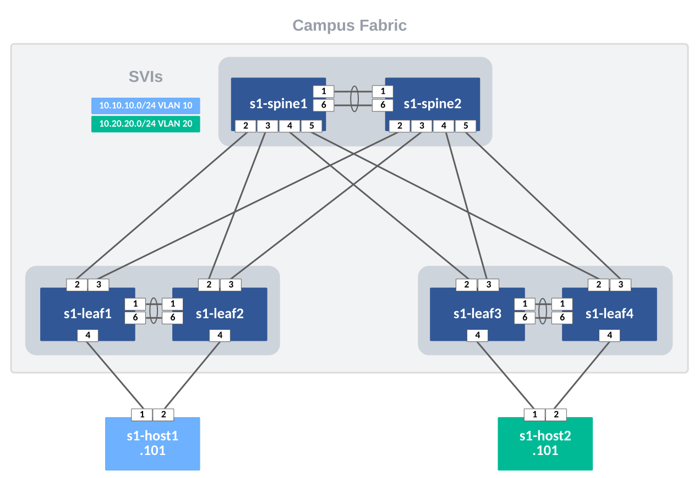
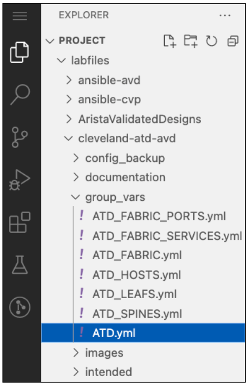
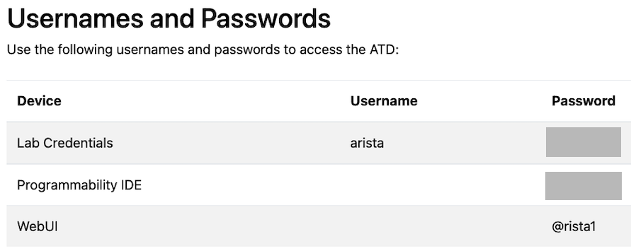

# Cleveland ATD - 11/02/2022

This repository builds an L2LS Campus fabric onto the Dual Data Center ATD Lab. The below diagram respresents a single DC within the larger Lab topology. Using AVD, we will build and deploy configurations for an example Campus Fabric.



## Requirements

- Need a running Dual Data Center ATD Lab.

## STEP #1 - Install AVD and Modules

Launch the Progammability IDE (lefthand column of Lab Topology) and start a new terminal session.


From the terminal session, run the following installation script. This will prep your host with AVD and install module requirements.

``` bash
bash -c "$(curl http://www.packetanglers.com/installavd.sh)"
```

Change to the following directory. All following commands will be ran from here.

``` bash
cd labfiles/cleveland-atd-avd
```

## STEP #2 - Update Passwords and SSH Keys

From the Programmibility IDE Explorer, navigate to the `labfiles/cleveland-atd-avd`



Click on the **group_vars/ATD.yml** file to open an editor tab and update the following **three** variables:

- line 5 - `ansible_password:` with your Lab's unique password
- line 49 - `sha512_password:` from a switch
- line 50 - `ssh_key:` from a switch

The `ansible_password` variable is used by Ansible to log into your switches to deploy configurations. The password is unique to your Lab instance and can be found from the **Usernames and Passwords** section of your lab topology screen.



``` yaml
---

# Credentials for CVP and EOS Switches
ansible_user: arista
ansible_password: XXXXXXXXXXX # Update password with your Lab's password
ansible_network_os: arista.eos.eos
```

Update the switches local `arista` user with a sha512 password by typing to the following on one of your Lab switches.

``` bash
config
username arista privilege 15 role network-admin secret XXXXXXXX # your unique Lab password
```

Now we can display the sha512 password and ssh key by typing the following command.

``` bash
show run section username

username admin privilege 15 role network-admin secret 5 $1$5O85YVVn$HrXcfOivJEnISTMb6xrJc.
username arista privilege 15 role network-admin secret sha512 $6$ebPETJmTzMXalZW0$7zyBIqsR/yjRh2LVL45dFLS5YSEGLfmrnnZtBNcaXW1YncuNWI6UMhk2wOmalqhSL/lFNhMpKhXnY.ztYXtQ31
username arista ssh-key ssh-rsa AAAAB3NzaC1yc2EAAAADAQABAAABAQDw05IMB87NmRYiVQZi5kr6Lqm4fyVMkWpRj3eh7iSiEMckeTuF9DLQtIHLOvGWt7R+3WJmsfTJwkm/yDql0tOUda9f5RPr0/CY97xwWipGbqtRW0Tqp8EhkWkpGJL+DUcrczAChovomWFj2PUpq+sjNAVzQEYtkN9ZIF58WwkYYW4AeApIq/AyS0N5ET5t4g9hUYwOcRDlJdykWDfdzdKZV3e4hKi+HejHFS3qnKDKeHavLfOxlSG/PQrL7guAqnH4NOdm9TjJ9l9R0K8MBE3iPLTcMQm5Ek+pDfRiCjhcTyd5XWkR3Rl/tFqiB+Qis/WA31sJTXqgVKodn+vVekUh arista@cleveland-atd-avd-1-30e03f6d
```

Now update sha512_password and ssh_key with these values. _Remember to keep the double quotes and DO NOT REMOVE `ssh-rsa` from the ssh_key variable._

- line 49 - `sha512_password:`
- line 50 - `ssh_key:`

``` yaml
# local users
local_users:
  arista:
    privilege: 15
    role: network-admin
    # Update sha512_password and ssh_key from one of your Lab switches
    sha512_password: "XXXXXXXXXXXXXXXXXXXXXXXXXX"
    ssh_key: "ssh-rsa XXXXXXXXXXXXXXXXXXXXXXXXXXXXXXXXXXXXXX"
```

## STEP #3 - Build Configs

From the terminal window, run the command below to execute an ansible playbook and build the AVD generated configurations and store them in a local directory `intended/configs`.

``` bash
make build
```

## STEP #4 - Deploy Configs to your Lab Fabric

The command below will build your configuration files and deploy them to your switches. This playbook uses Arista's eAPI & eos_config module to do a config replacement of the switches running_config.

``` bash
make deploy
```

## STEP #5 - Test Traffic from Host1 to Host2

Connect to `s1-host` and ping `s1-host2`

``` bash
ping 10.20.20.101

PING 10.20.20.101 (10.20.20.101) 72(100) bytes of data.
80 bytes from 10.20.20.101: icmp_seq=1 ttl=63 time=34.0 ms
80 bytes from 10.20.20.101: icmp_seq=2 ttl=63 time=30.2 ms
80 bytes from 10.20.20.101: icmp_seq=3 ttl=63 time=25.2 ms
80 bytes from 10.20.20.101: icmp_seq=4 ttl=63 time=21.1 ms
80 bytes from 10.20.20.101: icmp_seq=5 ttl=63 time=23.0 ms
```
