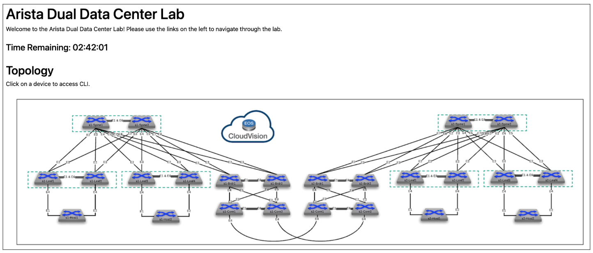

# Cleveland ATD - 11/02/2022

This repository builds a L2LS Campus fabric on the Dual Data Center ATD Lab. The below diagram respresents a single Campus Fabric within the larger Lab topology. Using AVD, we will build and deploy configurations for the 2 spines and 2 leaf pairs.  In addition we will explore adding port configurations to support 802.1x NAC features.


## Requirements

- Start the Dual Data Center ATD Lab



## STEP #1 - Launch Programmability IDE

- Launch the Progammability IDE.  If this is the first time starting the IDE you will be prompted for a code-server password.  Your unique password is noted on the Lab Topology page.


- Click through any pop-ups that may occur.
- Start a new terminal session by clicking on the hamburger and selecting Terminal->New Terminal.


## STEP #2 - Install AVD

- From the terminal session, run the following installation script.

``` bash
bash -c "$(curl http://www.packetanglers.com/installavd.sh)"
```

## STEP #3 - Change Working Directory

- Change working directory. All other commands will be executed from here.

``` bash
cd labfiles/cleveland-atd-avd
```

## STEP #4 - Update Passwords and SSH Keys

From the Programmibility IDE Explorer:

- Navigate to the `labfiles/cleveland-atd-avd/group_vars` folder.
- Click on the **group_vars/ATD.yml** file to open an editor tab.
- Update the following three variables in ATD.yml file.
  - Line 5 - `ansible_password:`
  - Line 49 - `sha512_password:`
  - Line 50 - `ssh_key:`

### Line 5 - ansible_password

- Update `ansible_password` key (line 5) with your unique lab password found on the **Usernames and Passwords** section of your lab topology screen.

``` yaml
# group_vars/ATD.yml
#
# switch credentials
ansible_password: aristaxl6a
```

### Line 49 - sha512_password

- Convert the current `arista` username type 5 password to a sha512 by running the following commands on one of your switches. Substitute XXXXXXX with your Lab's unique password.

``` bash
config
username arista privilege 15 role network-admin secret XXXXXXXX
```

- Retrieve sha512 password and ssh key for user `arista`.

``` bash
show run section username | grep arista
```

Look for output similar to:

``` bash
username arista privilege 15 role network-admin secret sha512 $6$ebPETJmTzMXalZW0$7zyBIqsR/yjRh2LVL45dFLS5YSEGLfmrnnZtBNcaXW1YncuNWI6UMhk2wOmalqhSL/lFNhMpKhXnY.ztYXtQ31
username arista ssh-key ssh-rsa AAAAB3NzaC1yc2EAAAADAQABAAABAQDw05IMB87NmRYiVQZi5kr6Lqm4fyVMkWpRj3eh7iSiEMckeTuF9DLQtIHLOvGWt7R+3WJmsfTJwkm/yDql0tOUda9f5RPr0/CY97xwWipGbqtRW0Tqp8EhkWkpGJL+DUcrczAChovomWFj2PUpq+sjNAVzQEYtkN9ZIF58WwkYYW4AeApIq/AyS0N5ET5t4g9hUYwOcRDlJdykWDfdzdKZV3e4hKi+HejHFS3qnKDKeHavLfOxlSG/PQrL7guAqnH4NOdm9TjJ9l9R0K8MBE3iPLTcMQm5Ek+pDfRiCjhcTyd5XWkR3Rl/tFqiB+Qis/WA31sJTXqgVKodn+vVekUh arista@cleveland-atd-avd-1-30e03f6d
```

- Update the sha512_password and ssh_key with the above values. _Remember to keep the double quotes and DO NOT REMOVE `ssh-rsa` from the ssh_key._

- line 49 - `sha512_password:`
- line 50 - `ssh_key:`

Your file should look similar to below.  **DO NOT USE** these values, but rather the ones from your show command output, as they are unique to your switches.

``` yaml
# group_vars/ATD.yml
#
# local users to be configured on switch
local_users:
  arista:
    sha512_password: "$6$ebPETJmTzMXalZW0$7zyBIqsR/yjRh2LVL45dFLS5YSEGLfmrnnZtBNcaXW1YncuNWkldsajgd7lqhSL/lFNhMpKhXnY.ztYXtQ31"
    ssh_key: "ssh-rsa AAAAB3NzaC1yc2EAAAADAQABAAABAQDw05IMB87NmRYiVQZi5kr6Lqm4fyVMkWpRj3eh7iSiEMckeTuF9DLQtIHLOvGWt7R+3WJmsfTJwkm/yDql0tOUda9f5RPr0/CY97xwWipGbqtRW0Tqp8EhkWkpGJL+DUcrczAChovomWFj2PUpq+sjNAVzQEYtkN9ZIF58WwkYYW4AeApIq/Ay89P7ASDJGFEALIUYFCEAYwOcRDlJdykWDfdzdKZV3e4hKi+HejHFS3qnKDKeHavLfOxlSG/PQrL7guAqnH4NOdm9TjJ9l9R0K8MBE3iPLTcMQm5Ek+pDfRiCjhcTyd5XWkR3Rl/tFqiB+Qis/WA31sJTXqgVKodn+vVekUh arista@cleveland-atd-avd-1-30e03f6d"
```

## STEP #5 - Build Configs

From the terminal window, run the command below to execute an ansible playbook and build the AVD generated configurations and store them in a local directory `intended/configs`.

``` bash
make build
```

> This command executes the following: `ansible-playbook playbooks/build.yml`

## STEP #6 - Deploy Configs to your Lab Fabric

Use either one of the methods below to deploy your configurations to your switches.

### Method #1 - eAPI

This playbook uses Arista's eAPI & eos_config module to do a config replacement of the switch's running_config.

``` bash
make deploy
```

### Method #2 - CVP

This playbook uses Arista's AVD Galaxy collection to deploy configurations via CVP.  Login to CVP to watch what happens while the playbook runs.

It does the following:

1. Creates configlets and pushes them to CVP
2. Creates a container topology based on inventory groups
3. Moves devices to container
4. Attaches configlets to devices
5. Creates Tasks

> You will need to create a Change Control in CVP to execute the tasks.  This can be automated as well with setting `execute_tasks: true` in the playbook.

``` bash
make deploy-cvp
```

## STEP #7 - Test Traffic from Host1 to Host2

Connect to `s1-host` and ping `s1-host2`

``` bash
ping 10.20.20.101

PING 10.20.20.101 (10.20.20.101) 72(100) bytes of data.
80 bytes from 10.20.20.101: icmp_seq=1 ttl=63 time=34.0 ms
80 bytes from 10.20.20.101: icmp_seq=2 ttl=63 time=30.2 ms
80 bytes from 10.20.20.101: icmp_seq=3 ttl=63 time=25.2 ms
80 bytes from 10.20.20.101: icmp_seq=4 ttl=63 time=21.1 ms
80 bytes from 10.20.20.101: icmp_seq=5 ttl=63 time=23.0 ms
```

## Network Ports and 802.1x Port Profiles

 In a Campus environment, we typically configure a range of ports within a leaf switch to have the same charactestics (vlan, mode, portfast, NAC, etc...).  AVD provides a way to define a **Port Profile** and then apply it to a range of ports on multiple switches.

### Typical Campus Port Configuration

``` bash
interface EthernetX
   switchport trunk native vlan 10
   switchport phone vlan 15
   switchport phone trunk untagged
   switchport mode trunk phone
   switchport
   dot1x pae authenticator
   dot1x authentication failure action traffic allow vlan 999
   dot1x reauthentication
   dot1x port-control auto
   dot1x host-mode multi-host authenticated
   dot1x mac based authentication
   dot1x timeout tx-period 3
   dot1x timeout reauth-period server
   dot1x reauthorization request limit 3
   spanning-tree portfast
   spanning-tree bpduguard enable
```

To configure ports Ethernet7-48 on s1-leaf1 and s1-leaf2 with the above configuration open file **group_vars/ATD_FABRIC_PORTS.yml**  and uncomment lines 25-57.

``` yaml
network_ports:

# # ---------------- s1-leaf1/2 ----------------

#   - switches:
#       - s1-leaf[12] # regex match s1-leaf1 & s1-leaF2
#     switch_ports:
#       - Ethernet7-48
#     profile: PP-DOT1X
#     native_vlan: 10
#     structured_config:
#       phone:
#         trunk: untagged
#         vlan: 15
#     dot1x:
#       authentication_failure:
#         action: allow
#         allow_vlan: 999
```

Update the switch configurations with the new ports by running the following command.

``` bash
make build
```

View updated configs in `intended/configs`.
